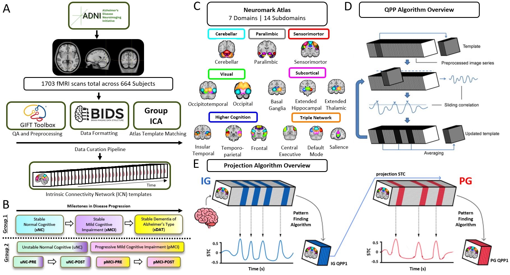
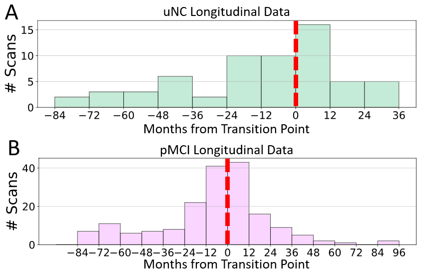
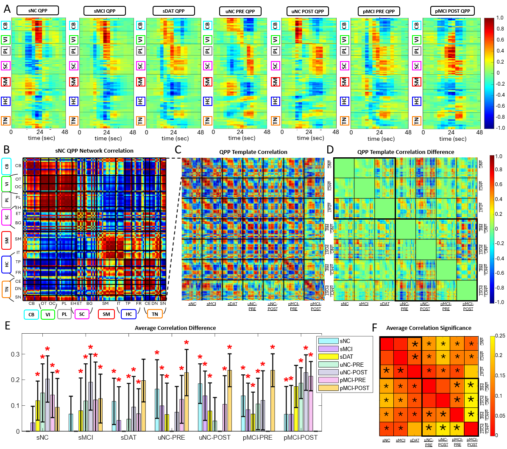
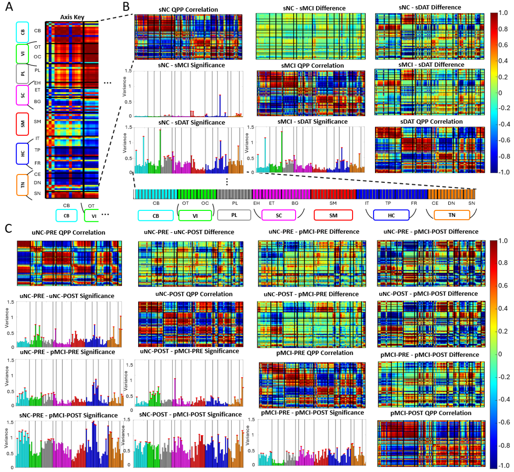
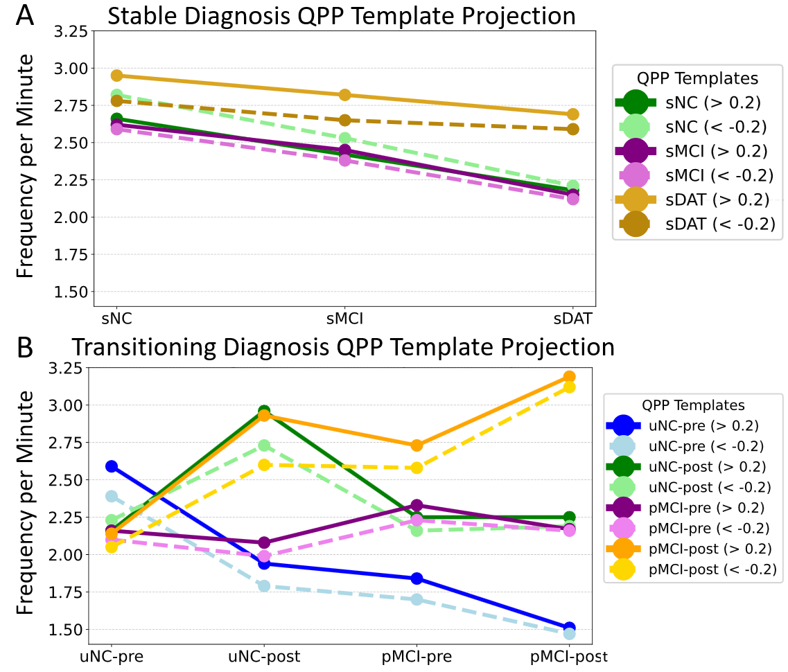
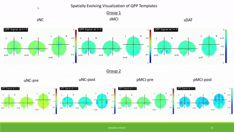

# **Figures for EMBC Paper**
This folder contains the key figures used in the **EMBC paper**, showcasing **Quasi-Periodic Pattern (QPP) analysis** and **functional connectivity changes** in the **ADNI dataset**.

Each figure highlights different aspects of the analysis, including **QPP waveform visualization, network correlations, and projection results**.

---

## **📌 Figure 1: Overview of Spatiotemporal Projection**

  

**Description:**  
(A) Preprocessing pipeline for the **ADNI dataset** into **Intrinsic Connectivity Networks (ICNs)**.  
(B) Experimental groups categorized as **Group 1** (sNC, sMCI, sDAT) and **Group 2** (uNC-PRE, uNC-POST, pMCI-PRE, pMCI-POST).  
(C) ICNs from the **NeuroMark v2.2 Atlas**, with **7 Domains and 14 Subdomains** labeled.  
(D) Overview of the **QPP Algorithm** from Majeed et al. (2011).  
(E) Overview of **spatiotemporal pattern template projection**, adapted from Belloy et al. (2018).  

---

## **📌 Figure 2: Longitudinal Demographics of Group 2**

  

**Description:**  
Histograms of available scans from longitudinal subjects who **changed diagnosis** during the study.  
(A) Transition from **NC to MCI (uNC)**.  
(B) Transition from **MCI to DAT (pMCI)**.  
The **red line** marks "Month 0," where the diagnosis changed. Each **histogram bin = 12 months**.

---

## **📌 Figure 3: Evaluation of QPP Templates**

  

**Description:**  
(A) QPP templates for each **ADNI diagnosis group**, organized by **NeuroMark domains**.  
(B) **Network correlations** of the **sNC QPP template**.  
(C) Correlations of **QPP templates** across **disease progression**.  
(D) **Self-correlation baseline** to evaluate **network integrity** across templates.  
(E) **Average correlation difference** between QPP templates. **Red asterisks** indicate significant differences.  
(F) **Kruskal-Wallis test** for ICN functional connectivity differences, with **asterisks** denoting **p < 0.05**.

---

## **📌 Figure 4: Network Correlation Differences**

  

**Description:**  
(A) **Axis key** for domains and subdomains.  
(B-C) **Network correlation differences** for each group:  
- **Diagonal**: QPP network correlation.  
- **Upper triangular**: **QPP correlation differences**.  
- **Lower triangular**: **Variance across networks** (red dots indicate significant differences).  
(B) **Group 1** (Stable Diagnosis).  
(C) **Group 2** (Transitioning Diagnosis).

---

## **📌 Figure 5: QPP Projection Results**

  

**Description:**  
- **QPP Occurrences per minute** calculated based on correlation **(> 0.2 or < -0.2 for reverse phase)**.  
- **QPP templates projected** onto all datasets, including **self-comparison**.  
- Results **demonstrate QPP integrity** within each dataset and show a **decline in QPP occurrence** over disease progression.

---

## **🎞️ Animated Visualization**

  

**Description:**  
Animated visualization of **QPP waveforms and their projection** across the **ADNI dataset**.

---

## **📌 How to Use**
- These figures are used in the **EMBC paper** for visualizing QPP analysis.  
- **Reproducible MATLAB scripts** for generating these figures can be found in the `code/` directory.  

For more details, check out the **main repository**.

---

## **📌 Citation**
If you use these figures or data, please cite the corresponding **EMBC paper**.

---

